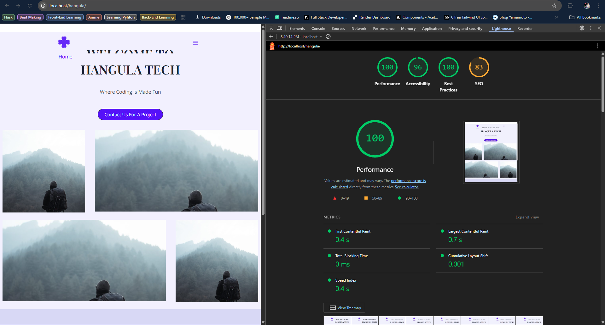

# WordPress Demonstration Site

A clean, performant, and well-structured WordPress site built to demonstrate core development skills including theme customization, custom post types, and performance optimization.

## 📋 Project Overview

This project was built to fulfill the following goals:
*   **Clean Structure:** Implemented using a child theme for safe customization.
*   **Theme Skills:** Utilized the popular Astra theme for its lightweight foundation and extended it with a child theme.
*   **Attention to Detail:** Focus on semantic HTML, responsiveness, and visual consistency across all pages.

### Scope Delivered:
*   **Pages:** Home, Services, About, Contact.
*   **Custom Post Type (CPT):** "Services" CPT, created with Custom Post Type UI.
*   **Enhanced CPT:** Custom fields added to the Services CPT using Advanced Custom Fields (ACF) and displayed on the front-end.
*   **Contact Form:** A working form built with Contact Form 7, featuring client and server-side validation.
*   **Performance:** Optimized to target Lighthouse scores ≥ 85.
*   **Security:** Implemented basic security hardening measures.

## 🛠️ Technical Stack

*   **WordPress:** `6.7.x`
*   **PHP:** `8.1+` (Recommended: 8.2)
*   **MySQL:** `5.7+` or `MariaDB 10.4+`
*   **Parent Theme:** Astra (`v4.9.x`)
*   **Child Theme:** Custom (`astra-child`)

### Plugins Used:
| Plugin | Purpose | Status |
| :--- | :--- | :--- |
| **Advanced Custom Fields** | Added custom fields (e.g., icon, price) to the Services CPT. | Active |
| **Contact Form 7** | Created and managed the functional contact form. | Active |
| **Custom Post Type UI** | Registered the custom "Services" post type and taxonomy. | Active |
| **Elementor** & **Essential Addons**| Used for building and designing certain pages (e.g., Homepage). | Active |
| **Kadence Blocks** | Enhanced the Gutenberg editor for building inner pages. | Active |
| **Stop User Enumeration** | Basic security: blocked user enumeration attacks. | Active |
| **Title Remover** | Allowed selective hiding of page titles for design purposes. | Active |
| **Caching Plugin** |  WP Super Cache - Used for performance but not in repo.* | Active |

## ⚙️ Setup & Installation

1.  **Environment:** Ensure your server meets the PHP and MySQL requirements.
2.  **Install WordPress:** Perform a standard WordPress installation.
3.  **Upload Theme and Plugins:**
    *   Upload the provided `astra-child` folder to `/wp-content/themes/`.
    *   Upload all provided plugins to `/wp-content/plugins/`.
4.  **Activate:**
    *   In the WordPress Admin, go to **Appearance > Themes** and activate the **Astra Child** theme.
    *   Go to **Plugins**, activate all the plugins included in the deliverables.
5.  **Import Content (Two Options):**
    *   **Option A (Preferred - using AIOWM):** Use the "All-in-One WP Migration" plugin. Go to **All-in-One WP Migration > Import** and upload the provided `.wpress` file.
    *   **Option B (using WordPress Export):** Go to **Tools > Import**, install the "WordPress importer", and upload the provided `.xml` file. You will need to reassign the menu and re-configure a few settings afterwards.
6.  **Update Permalinks:** Go to **Settings > Permalinks** and simply click "Save Changes" to flush rewrite rules and ensure CPT links work correctly.
7.  **Optional - Caching:** For performance, install and configure a caching plugin like WP Super Cache or W3 Total Cache.

## 🏗️ Architecture & Trade-offs

### Child Theme Structure (`astra-child`)

### Lighthouse Score

